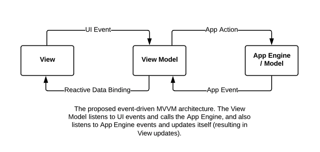

# PowerStack NextJS Starter

NextJS application starter for rapid development of multi-chain applications.

⚡️ [PowerStack: a powerful fullstack development framework](https://powerstack.xyz).

_Disclaimer: This is a work in progress. Will be finalized soon._

Demo <https://powerstack-next.vercel.app/>

## Architecture



## Features

- Web2 and Web3 authentication ( EVM, Solana, Antelope, Web3Auth ).
- Wallet integration: sign messages and transactions.
- Upload to Arweave using Blundr.
- Upload to IPFS using Pinata.
- Mint on Solana, EVM and Antelope blockchains.
- Read account token balances and nfts.
- GraphQL client with support for multiple indexers.
- Portable agnostic vanillajs core logic store with Zustand.
- Utilities for decimal precision, math and trigonometry in js.
- Utilities library for common web2 and web3 tasks.
- Lighthouse CI web vitals performance reports.
- CSS-in-JS design system Stitches.
- Import design tokens from Toolabs Design Manager.
- Autogenerate Icons as React Components from Toolabs Design Manager.
- Autogenerate TypeScript types from GraphQL schema.
- Crash reporting and web analytics.
- Base ui components with forms validation.
- Internationalization with i18next.
- TypeScript, ESLint, Prettier and Husky for code quality.
- Read coin prices from CoinGecko API.
- Docker support and Taskfile.

## Tech Stack

- NextJS [nextjs.org](https://nextjs.org)
- Zustand store [pmndrs/zustand](https://github.com/pmndrs/zustand)
- Stitches styling [stitches.dev](https://stitches.dev)
- Ethers [docs.ethers.io](https://docs.ethers.io/v5)
- Solana Web3 [solana-labs/solana-web3.js](https://github.com/solana-labs/solana-web3.js)
- TweetNaCl.js [dchest/tweetnacl-js](https://github.com/dchest/tweetnacl-js)
- Eosio Core [greymass/eosio-core](https://github.com/greymass/eosio-core)
- Decimal.js [MikeMcl/decimal.js](https://github.com/MikeMcl/decimal.js)
- Iron Session [vvo/iron-session](https://github.com/vvo/iron-session)
- Lodash tools [lodash.com/docs](https://lodash.com/docs)
- Zod validator [colinhacks/zod](https://github.com/colinhacks/zod)
- React-use hooks [streamich/react-use](https://github.com/streamich/react-use)
- Sentry reporting [sentry.io/](https://sentry.io/)
- Next i18next [i18next/next-i18next](https://github.com/i18next/next-i18next)

## State Management

Core logic in presentation components is a general problem in react, the solution is zustand, a portable agnostic store in vanillajs. By putting all core logic on zustand store we prevent render logic hell (no complicated useEffect functions) and we remove duplication and reduce complexity.

We use a Zustand based JavaScript Core Engine both on the server within [getServerSideProps](https://nextjs.org/docs/basic-features/data-fetching/get-server-side-props) for server side rendering and on the browser to provide the UX posible while keeping state management simple and contained.

We hydrate the App Engine Zustand Store from the server in `_app.tsx` in order to prevent server/client render mistmatches.

The app-engine is fully portable and be reused on any client ( vuejs, cli, react native ) and could be wrapped on npm package sdk.

### GraphQL Client

PowerStack leverages open source Hasura GraphQL engine in conjunction with GraphQL codegen to genere common typescript types generated from the graph schema. We love prisma and we use it on nodejs services, however for client applications we prefer to keep a single form of data fetching and prevent duplicated types for the data structures.

- Endpoint: <https://api.powerstack.xyz/v1/graphql>
- Explorer: <https://explorer.powerstack.xyz>

#### GraphQL Development Flow

1. test your query on [explorer.powerstack.xyz](https://explorer.powerstack.xyz).
2. copy paste the query to `app-engine/graphql/schema.graphql`.
3. execute `yarn graphql`
4. utilize the generated sdk and types in zustand and `getServerSideProps`

See [blockmatic/powerstack-hasura](https://github.com/blockmatic/powerstack-hasura) for more information.

### Toolabs Design System

To increase the power of our stack, it consists of an auto-generator of themes, brought by the [Toolabs Design Tool](https://app.toolabs.com/#/). The script obtains the tokens declared in the tool through its GraphQL Client and passing the access key as an environment variable.

If it finds iconography, it will auto-generate the icons and create an index to consume them. These are ready to receive React Properties.

See [theme generator](_scripts\theme-gen\index.ts) for tech details.

### Toolabs Development Flow

1. Go to the Design Toolabs tool of your project.
2. Verify your access key in the GraphQL API tab.
3. Copy the key and paste it as `THEME_GEN_KEY` in `.env.development.`
   1. **OPTIONAL:** You can specify which theme to subtract by passing themes IDs as `THEME_GEN_THEMES` with comma `,` separated.
4. Run `yarn theme` to auto-generate themes.

#### Toolabs Development Flow Step 1 & 2


#### Toolabs Development Flow Optional Step


### File Structure

```
.
├── _docs.................................... documentation files and media
├── _scripts................................. utility devops scripts
├── app-config............................... environment variables and secrets
|   ├── app-arguments.ts..................... application arguments
|   └── server-secrets.ts ................... server side secrets
|
├── app-engine............................... portable vanillajs core logic ( app engine )
|   ├── graphql.............................. graphql module
|   |   ├── schema.graphql................... client app schema ( app-engine )
|   |   ├── generated-sdk.ts................. autogenerated ts types and graphql apis
|   |   ├── graphql-client.ts................ multi-link multi-indexer graphql client
|   |   ├── codegen.yml...................... codegen configuration
|   |   └── index.ts......................... main module entry and api exports
|   |
|   ├── library.............................. pure function utils ( input->output, deterministic, no side effects )
|   |   ├── encoding.ts...................... encoding functions
|   |   ├── antilope.ts...................... antilope and anchor wallet uitls
|   |   ├── errors.ts........................ app-engine error classes
|   |   ├── ethers.ts........................ evm utils
|   |   ├── exec-env.ts...................... execution environment variables
|   |   ├── fetch.ts......................... window fetch wrapper
|   |   ├── logger.ts........................ logger object
|   |   ├── solana.ts........................ solana and phantom wallet utils
|   |   ├── uiux.ts.......................... utils for better ux
|   |   └── web3auth.ts...................... web3auth utils
|   |
|   ├── services............................. abstractions for http apis ( sdks, third party )
|   |   ├── infura.ts........................ infura config and client
|   |   ├── sentry.ts........................ crash reporting instance
|   |   └── cloudinary.ts.................... image optimization and cdn
|   |
|   └── store................................ portable vanillajs state machine
|       ├── engine-slice.ts.................. app-engine state flags
|       ├── antelope-slice.ts................ antelope and anchor wallet logic
|       ├── ethers-slice.ts.................. evm and metamask wallet logic
|       ├── network-slice.ts................. multi-chain and network switching logic
|       ├── solana-slice.ts.................. solana and phantom wallet logic
|       ├── user-slice.ts.................... app user data and functions
|       ├── view-slice.ts.................... app view / ui state
|       └── web3auth-slice.ts................ web3auth and torus logic
|
├── app-server .............................. server side logic
|
├── app-view ................................ presentation logic, jsx, animations
|   ├── components........................... reactjs components
|   |   ├── base............................. default base/primitive components
|   |   ├── modules.......................... standalone modular components
|   |   ├── layout........................... structure focused components
|   |   └── icons............................ icon svgs in react components
|   |
|   └── styles............................... stitches configuration
|       ├── themes........................... generated themes from toolabs dsm
|       ├── global.ts........................ global styles
|       ├── index.ts......................... exports getGeneratedStylesheet
|       └── stitches.config.ts............... stitches config
|
├── pages.................................... standard nextjs page components
├── Dockerfile............................... docker container definition
└── Taskfile.yml............................. utility tasks for docker based dev
```

## Getting Started

First, run the development server:

```bash
yarn dev
```

Open [http://localhost:3000](http://localhost:3000) with your browser to see the result.

## Commands

- `dev`: runs your application on `localhost:3000`.
- `build`: creates the production build version.
- `start`: starts a simple server with the build production code.

## Docker

```bash
# Build the image
docker build -t powerstack-next:local .

# Start a container
docker run --name powerstack-next --env-file .env -p 3000:3303 -d powerstack-next:local

# Get container ID
docker ps -aqf "name=^powerstack-next$"

# Print app output
docker logs -f powerstack-next

# Stop, start, restart, kill
docker stop powerstack-next
docker start powerstack-next
docker restart powerstack-next
docker kill powerstack-next
```

## Contributing

We use a [Discussions Board](https://github.com/blockmatic/powerstack-docs/discussions/1) to gather thoughts, bug reports and feature requests from the community.

Follow the standard Github Flow for PRs. [Contributing Guidelines](https://docs.powerstack.xyz/powerstack/other-resources/contributing-guidelines).

## Blockmatic

Blockmatic is building a robust ecosystem of people and tools for the development of blockchain applications.

[blockmatic.io](https://blockmatic.io)

<!-- Please don't remove this: Grab your social icons from https://github.com/carlsednaoui/gitsocial -->

<!-- display the social media buttons in your README -->

[![Blockmatic Twitter][1.1]][1]
[![Blockmatic Facebook][2.1]][2]
[![Blockmatic Github][3.1]][3]

<!-- links to social media icons -->
<!-- no need to change these -->

<!-- icons with padding -->

[1.1]: http://i.imgur.com/tXSoThF.png 'twitter icon with padding'
[2.1]: http://i.imgur.com/P3YfQoD.png 'facebook icon with padding'
[3.1]: http://i.imgur.com/0o48UoR.png 'github icon with padding'

<!-- icons without padding -->

<!-- links to your social media accounts -->
<!-- update these accordingly -->

[1]: http://www.twitter.com/blockmatic_io
[2]: http://fb.me/blockmatic.io
[3]: http://www.github.com/blockmatic

<!-- Please don't remove this: Grab your social icons from https://github.com/carlsednaoui/gitsocial -->
