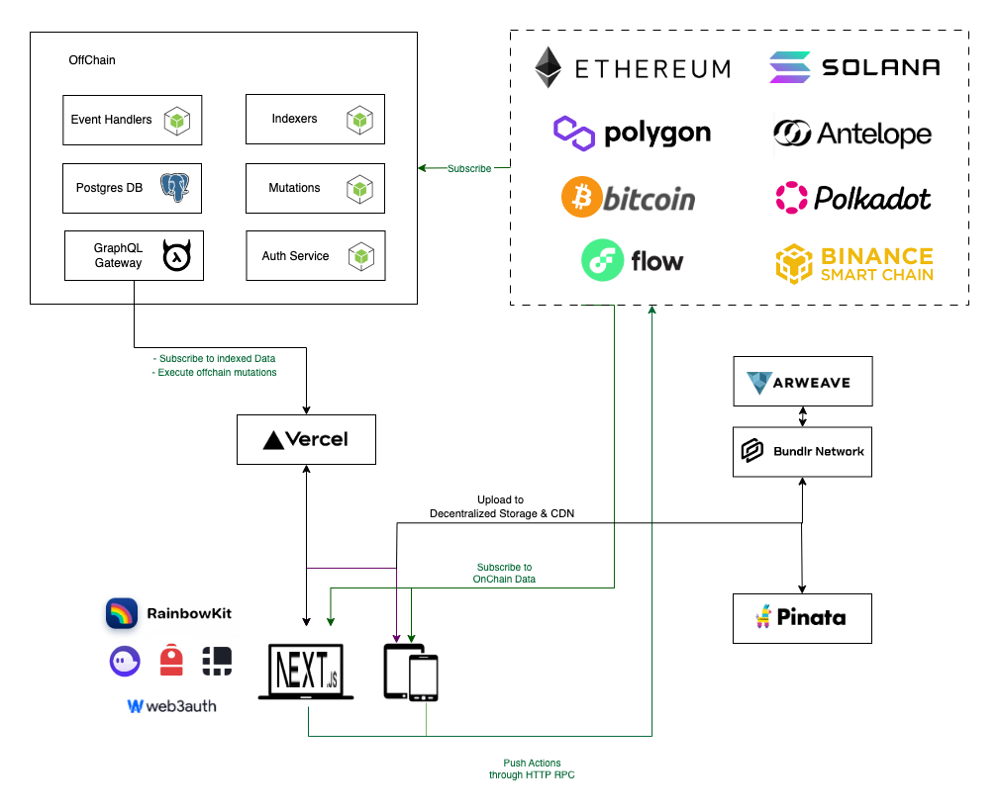

# PowerStack

A dApp Development Toolkit that provides starters, guidelines, and tools for rapid development.




_ This is a work in progress._

## Features

- Web2 and Web3 authentication ( EVM, Solana, Antelope, Web3Auth, Flow ).
- Read and modify blockchain state, sign messages and transactions.
- Read token prices and market data.
- Utility first CSS with TailwindCSS components with shadcn/ui.
- Upload files to Arweave using Blundr.
- Upload files to IPFS using Pinata.
- Utilities for decimal precision and math.
- Code-First GraphQL clients with genql.
- Turbo monorepo and pnpm package manager for fast builds.
- Smart contract development environments.
- Web2 APIs for offchain processing.
- TypeScript, ESLint, Prettier configs for code quality.
- Idiomatic, functional and declarative codestyle.
- Automated testing and deployment utilities.
- Code conventions and good documentation.

## Tech Stack

### EVM

- Hardhat [hardhat.org](https://hardhat.org/)
- Ethers [docs.ethers.io](https://docs.ethers.io/v5)
- Rainbow Kit [rainbowkit.com](https://www.rainbowkit.com)

### Solana

- Solana Web3 [solana-labs/solana-web3.js](https://github.com/solana-labs/solana-web3.js)
- TweetNaCl.js [dchest/tweetnacl-js](https://github.com/dchest/tweetnacl-js)
- Metaplex [metaplex.com](https://metaplex.com)
- Phantom & Backpack

### Antelope

- Wharfkit [wharfkit/antelope](https://github.com/wharfkit/antelope)
- Anchor

### Flow

- Niftory [niftory.com](https://niftory.com/)

### Decentralized Storage

- Bundlr Network [bundlr.network](https://bundlr.network)
- Pinata Cloud [pinata.cloud](https://www.pinata.cloud)

### Frontend

- NextJS [nextjs.org](https://nextjs.org)
- PreactJS [preactjs.com](https://preactjs.com/)
- Next Auth [next-auth.js.org](https://next-auth.js.org/)
- GenQL GraphQL Query Composer [remorses/genql](https://github.com/remorses/genql)
- TailwindCSS [tailwindcss.com](https://tailwindcss.com)
- Shadcn UI [ui.shadcn.com](https://ui.shadcn.com/)
- Class Variance Authority [cva.style](https://cva.style)
- Conditional Classes [package/clsx](https://www.npmjs.com/package/clsx)
- React Hook Form [react-hook-form.com](https://react-hook-form.com)
- React-use hooks [streamich/react-use](https://github.com/streamich/react-use)

### Backend (Offchain)

- Hasura GraphQL [hasura.io](https://hasura.io/)
- Prisma ORM [prisma.io](https://www.prisma.io/)
- Nexus GraphQL [nexusjs.org](https://nexusjs.org/)
- Docker [docker.com](https://www.docker.com/)

### Dev Tools

- Turbo Monorepo [turbo.build](https://turbo.build/repo/docs/handbook)
- pnpm [pnpm.io](https://pnpm.io/)

### Packages

- Decimal.js [MikeMcl/decimal.js](https://github.com/MikeMcl/decimal.js)
- Lodash tools [lodash.com/docs](https://lodash.com/docs)
- Zod validator [colinhacks/zod](https://github.com/colinhacks/zod)
- Date-fns [date-fns.org](https://date-fns.org/)
- Faker [fakerjs.dev](https://fakerjs.dev/): Generate massive amounts of fake data in the browser and node.js
- Currency.js [scurker/currency.js](https://github.com/scurker/currency.js): A small, lightweight javascript library for working with currency values.

## Coding Style

- Follow a functional and declarative code style using Modern JavaScript features and TypeScript.
- Use correct semantics and meaningful naming.
- Write small components that do one thing well, avoid big components.
- Favor composability over big objects, leverage pure functions and keep state simple and flat, avoid deeply nested objects.

## JavaScript Conventions

- naming variables: boolean should be named using auxiliary verbs such as `does`, `has`, `is` and `should`. For example, Button uses `isDisabled`, `isLoading`, etc.
- composition: break down components into smaller parts with minimal props to keep complexity low, and compose them together.
- filenames: create folders with and index, lowercase with dash separator for dirs and names `components/auth-wizard`, and five the following extensions each file acordingly `.config.ts`, `.component.tsx`, `.test.ts`, `.context.tsx`, `.type.ts`, `.hook.ts`
- avoid default export [default is bad](https://basarat.gitbook.io/typescript/main-1/defaultisbad)

```ts
const helloMessage = 'hello'
export function saySomething() {
  const someValue = 'fren'
  console.log(`${helloMessage} ${someValue}`)
}
```

- Receive an object, return an object (RORO).  
  [Elegant patterns in modern JavaScript: RORO](https://www.freecodecamp.org/news/elegant-patterns-in-modern-javascript-roro-be01e7669cbd/)

```ts
// services/account/account.service.ts
export async function getAccounts({ account, limit = 15, offset = 0 }: GetAccountsParams) {
  const where = account
    ? {
        account: {
          _eq: account,
        },
      }
    : null

  return getGraphQLSdk()
    .chain.query.accounts({
      where,
      limit,
      offset,
    })
    .get({ ...everything })
}

// types/services.type.ts
export interface ServiceParams {
  limit?: number
  offset?: number
}

// services/account/account.type.ts
export interface GetAccountsParams extends ServiceParams {
  account?: string
}
```

Most functions will receive an object and many of them return an object too.

Like any pattern, RORO should be seen as just another tool in our tool box. We use it in places where it adds value by making a list of parameters more clear and flexible and by making a return value more expressive.

If you’re writing a function that will only ever need to receive a single parameter, then receiving an object is overkill. Likewise, if you’re writing a function that can communicate a clear and intuitive response to the caller by returning a simple value, there is no need to return an object.

## ReactJS Conventions

- declare component with function keyword
- use const for methods
- place code in the following order
  - function component declaration
  - styled components
  - typescript types
  - getServerSideProps
- use ternaries rather than && in jsx

Eg.

```tsx
export function MyReactComponent({ myParam }: MyReactComponetParams) {
  const myMethod = () => console.log(myParam)

  return (
    <div className="bg-slate-100 md:flex ">
      A new world awaits. <br /> be the first to discover it.
      <button onClick={myMethod}>let's goo!</button>
    </div>
  )
}

export interface MyReactComponetParams {
  myParam: boolean
}
```

## State Management

When you write a component that holds some state, you’ll have to make choices about how many state variables to use and what the shape of their data should be. While it’s possible to write correct programs even with a suboptimal state structure, there are a few principles that can guide you to make better choices:

- Use preact signals: Signals are reactive primitives for managing application state. https://preactjs.com/guide/v10/signals/

- Group related state. If you always update two or more state variables at the same time, consider merging them into a single state variable. Avoid contradictions in state. When the state is structured in a way that several pieces of state may contradict and “disagree” with each other, you leave room for mistakes. Try to avoid this.

- Avoid redundant state. If you can calculate some information from the component’s props or its existing state variables during rendering, you should not put that information into that component’s state.

- Avoid duplication in state. When the same data is duplicated between multiple state variables, or within nested objects, it is difficult to keep them in sync. Reduce duplication when you can.

- Avoid deeply nested state. Deeply hierarchical state is not very convenient to update. When possible, prefer to structure state in a flat way.

The goal behind these principles is to make state easy to update without introducing mistakes. Removing redundant and duplicate data from state helps ensure that all its pieces stay in sync.

This is similar to how a database engineer might want to [“normalize”](https://learn.microsoft.com/en-us/office/troubleshoot/access/database-normalization-description) the database structure to reduce the chance of bugs.

[read more](https://beta.reactjs.org/learn/choosing-the-state-structure)

### Keep the state flat

Updating nested Javascript objects immutably generally results in uglier code that is harder to maintain, unless you use a utility library to wrap up the process.

Immutably updating nested data requires that you return new copies of all items in the nesting hierarchy. Since components generally do shallow-equality reference comparisons on data to see if they need to update, updating nested data usually means that more objects are updated, and more components will probably have to re-render even if the actual data isn't different.

Flat data, and in particular normalized data, enables some more optimized approaches for defining components (such as a list where each list item component is itself connected, given an item ID as a prop, and is responsible for looking up its own item's data by that ID)

### Prefer serializables

It is highly recommended that you only put plain serializable objects, arrays, and primitives into your store. It's technically possible to insert non-serializable items into the store, but doing so can break the ability to persist and rehydrate the contents of a store, as well as interfere with time-travel debugging.

If you are okay with things like persistence and time-travel debugging potentially not working as intended, then you are totally welcome to put non-serializable items into your store. Ultimately, it's your application, and how you implement it is up to you. As with many other things, just be sure you understand what tradeoffs are involved.

Use Arrays instead of Maps.

## Styling

PowerStack uses a Utility-First approach with TailwindCSS to develop faster with high quality.

This is a [great interview with TailwindCSS founder](https://open.spotify.com/episode/2NCNJ3AqEjALX2xza3JKkE?si=ZbnuQrwOT-C4agFxC6yTjg).

- maximizes the use of creative power in functionality; not creating class names and css structures.
- reduces of cognitive effort by not having to think about classes and hierarchies, changing or returning to the project is all the same.
- element changes are localized and you don't worry about breaking other things.
- the default theme is very good and simple to customize it to create your own design system.
- it is very intuitive. even without knowing the framework you can read the code and understand what is happening with relative ease
  the development experience is much better by not having to change files.
- tailwindui is great and the community is huge, you can copy paste any project and use it on your own without creating frankensteins
- you can use it in combination with emmet, since it only uses className.
- it enforce css based on constraints through theme and design tokens.
- it gives you better performance, really good with ssr ( nextjs/remix ).
- it removes the problems associated with preprocessors such as large bundles.
- it is relatively less complex than styled components (you need to know more about javascript).

Its possible to write variant based component using Class Variant Authority [cva.style](https://cva.style/docs)

## Services

The services directory contains vanillajs pure functions that interact with external apis. They encasulate logic for https, websocket and api queries.

## Turborepo

Learn more about the power of Turborepo:

- [Tasks](https://turbo.build/repo/docs/core-concepts/monorepos/running-tasks)
- [Caching](https://turbo.build/repo/docs/core-concepts/caching)
- [Remote Caching](https://turbo.build/repo/docs/core-concepts/remote-caching)
- [Filtering](https://turbo.build/repo/docs/core-concepts/monorepos/filtering)
- [Configuration Options](https://turbo.build/repo/docs/reference/configuration)
- [CLI Usage](https://turbo.build/repo/docs/reference/command-line-reference)

## Contributing

Follow the standard Github Flow for PRs.

## Blockmatic

Blockmatic is building a robust ecosystem of people and tools for the development of blockchain applications.

[blockmatic.io](https://blockmatic.io)

<!-- Please don't remove this: Grab your social icons from https://github.com/carlsednaoui/gitsocial -->

<!-- display the social media buttons in your README -->

[![Blockmatic Twitter][1.1]][1]
[![Blockmatic Facebook][2.1]][2]
[![Blockmatic Github][3.1]][3]

<!-- links to social media icons -->
<!-- no need to change these -->

<!-- icons with padding -->

[1.1]: http://i.imgur.com/tXSoThF.png 'twitter icon with padding'
[2.1]: http://i.imgur.com/P3YfQoD.png 'facebook icon with padding'
[3.1]: http://i.imgur.com/0o48UoR.png 'github icon with padding'

<!-- icons without padding -->

<!-- links to your social media accounts -->
<!-- update these accordingly -->

[1]: http://www.twitter.com/blockmatic_io
[2]: http://fb.me/blockmatic.io
[3]: http://www.github.com/blockmatic

<!-- Please don't remove this: Grab your social icons from https://github.com/carlsednaoui/gitsocial -->
